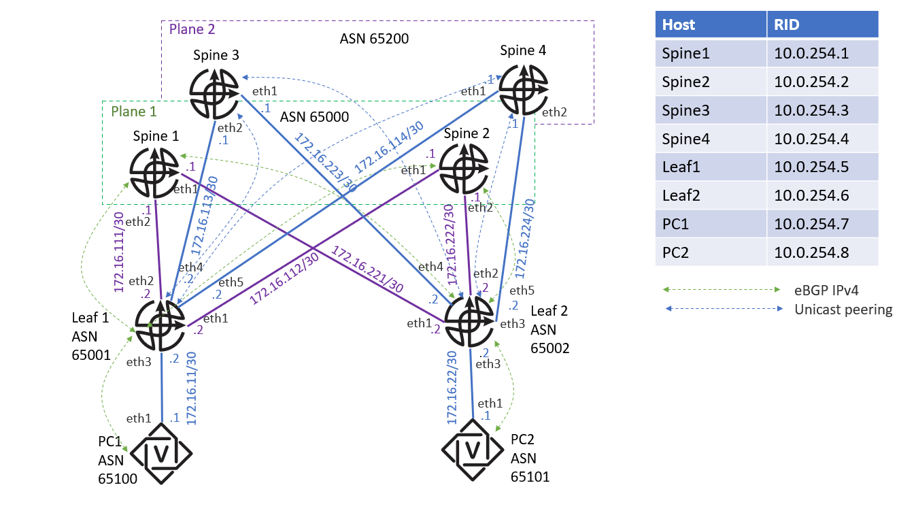

# Лабораторная работа 4: Конфигурация IP-фабрики в ЦОД на основе протокола BGP




# Задание к лабораторной работе
По аналогии с лабораторными работами 1 и 2 (необходимо создать папки leaf1, leaf2, spine1, spine2, spine3, spine4 и скопировать в них конфигурацию FRR из уже существующей папки, например, router1, собрать и запустить топологию виртуальной IP-фабрики согласно прилагаемой схеме. Топологический файл для containerlab прилагается.

```
$ cat frrlab4.yml
name: frrlab4
topology:
  nodes:
  leaf1:
    kind: linux
    image: frrouting/frr:latest
    binds:
      - leaf1/daemons:/etc/frr/daemons
  leaf2:
    kind: linux
    image: frrouting/frr:latest
    binds:
      - leaf2/daemons:/etc/frr/daemons
  spine1:
    kind: linux
    image: frrouting/frr:latest
    binds:
      - spine1/daemons:/etc/frr/daemons
  spine2:
    kind: linux
    image: frrouting/frr:latest
    binds:
      - spine2/daemons:/etc/frr/daemons
  spine3:
    kind: linux
    image: frrouting/frr:latest
    binds:
      - spine2/daemons:/etc/frr/daemons
  spine4:
    kind: linux
    image: frrouting/frr:latest
    binds:
      - spine2/daemons:/etc/frr/daemons
  PC1:
  kind: linux
  image: frrouting/frr:latest
  binds:
      - PC1/daemons:/etc/frr/daemons
  PC2:
  kind: linux
  image: frrouting/frr:latest
  binds:
    - PC2/daemons:/etc/frr/daemons
  links:
    - endpoints: ["leaf1:eth1", "spine2:eth1"]
    - endpoints: ["leaf1:eth2", "spine1:eth2"]
    - endpoints: ["leaf1:eth4", "spine3:eth2"]
    - endpoints: ["leaf1:eth5", "spine4:eth1"]
    - endpoints: ["leaf2:eth2", "spine2:eth2"]
    - endpoints: ["leaf2:eth1", "spine1:eth1"]
    - endpoints: ["leaf2:eth4", "spine3:eth1"]
    - endpoints: ["leaf2:eth5", "spine4:eth2"]
    - endpoints: ["PC1:eth1", "leaf1:eth3"]
    - endpoints: ["PC2:eth1", "leaf2:eth3"]
```

2. Настроить на всех устройствах IP-адреса согласно схеме. Router ID - RID, - это адрес lo интерфейса.
3. Проверить IP-связность между всеми парами устройств через прямые линки. Пинг должен быть успешным везде.
4. Убедиться, что на устройствах нет ни статической, ни динамической (ISIS) маршрутизации
5. Настроить маршрутизацию по протоколу eBGP (IPv4 Unicast AFI), используя номера ASN со схемы и схему пиринга, каждое устройство должно анонсировать в eBGP только свою локальную подсеть (lo интерфейс)
6. Проверить IP-связность между lo интерфейсами РС1 и РС2
7. Написать скрипт на Python, генерирующий базовую и BGP конфигурацию для каждого устройства
8. Написать скрипт на Python, выводящий требуемые команды:

```
docker ps

sh run (с каждого устройства)

sh ip route (с каждого устройства)

ping x.x.x.x (где x.x.x.x - адрес другого РС-маршрутизаторов, пинг должен быть успешным)

traceroute x.x.x.x (где x.x.x.x - адреса lo интерфейса другого РС-маршрутизатора, traceroute должен быть успешным )

show ip bgp summary

show ip bgp neighbors (BGP state = Established) Выписать адрес используемый для NH (если будет делаться задание 7, то также выписать IPv6 адреса NH)
```
sh ip bgp ( BGP таблица), на ее основе описать используемый AS PATH между РС1 и РС2. На РС1 и РС2 посмотреть маршрутную информацию о lo интерфейса другого lo (show ip bgp 10.0.254.5 и show ip bgp 10.0.254.6)
9.Дополнительное задание на 5+: переделать BGP конфигурацию на каждом устройстве с учетом возможностей FRR по unnumbered пирингу используя имя интерфейса в качестве neighbor и использования IPv6 NH для IPv4 пиринга (RFC 5549).
Критерии оценки:

Работающая IP-связность между РС1 и PC2 на основе протокола маршрутизации BGP.

    Приложить скрипт - генератор базовой и BGP конфигурации для всех устройств и сгенерированные им файлы конфигурации (в имени файла должно быть имя соотв. устройства и название лабораторной)

# Критерии оценки
Приложить скрипт -парсер нужных команд по выводу состояния для заданного устройства (show команды+ping/traceroute)
Не забыть про отражение в выводе используемого NH
По дополнительному заданию в п.9 , приложить модифицированный генератор конфигурации BGP, (проверить корректность работы с новой конфигурацией скрипта-парсера) и сгенерированные им файлы конфигурации (в имени файла должно быть имя соотв. устройства и название лабораторной)

Примечание: за выполненное дополнительное задание начисляются дополнительные баллы.