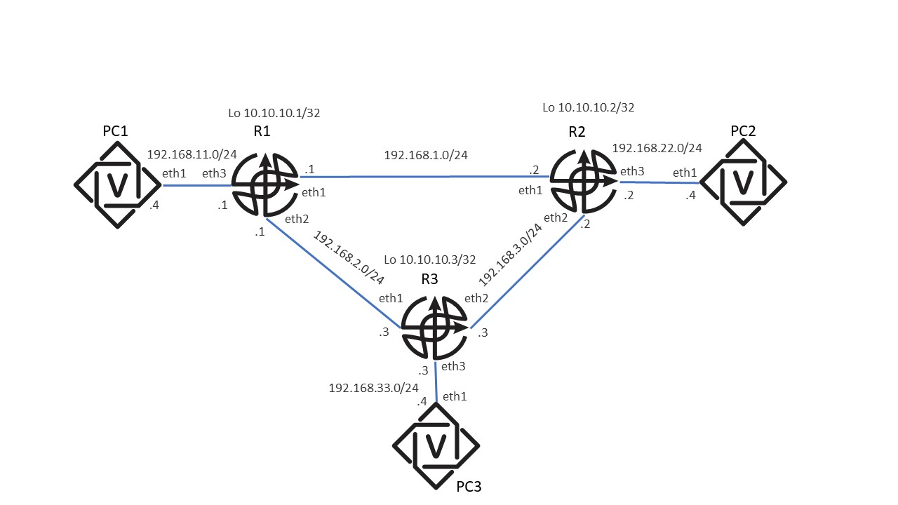

# Лабораторная работа 2: Динамическая маршрутизация с использованием протокола ISIS

# Cхема лабораторной работы:


## Задание к лабораторной работе:
1.Разобраться с CLI по настройке протокола ISIS на всех устройствах (контейнерах) согласно прилагаемой схеме (используется топология из Лабораторной работы 1) и примеру в Приложении, так чтобы:

1.1) Была IP-связность с lo (loopback) интерфейса R1 до lo интерфейсов R2 и R3 (аналогично от lo R2 до lo R1 и R3, от lo R3 до lo R1 и R2)

1.2) Была IP-связность между всеми РС, объяснить почему используется этот маршрут (2-3 предложения и подтверждающий вывод с маршрутизатора).

1.3) Разорвать (логически) линк между R1 и R2, проверить есть ли связность между РС1 и РС2, объясните полученный результат.

1.4) Дополнительное задание: Удалить на R1, на интерфейсе eth1 команду isis network point-to-point, объяснить в нескольких предложениях получившийся результат с приведением подтверждающих show команд с маршрутизатора.

2.Написать генератор конфигурации ISIS для остальных PC и R маршрутизаторов на Python (не забыть, что в нем нужна также и базовая конфигурация - IP-адреса итд.)

3. Написать скрипт на Python, делающий парсинг вывода следующих команд в читаемом формате, скрипт должен отображать с какого устройства осуществляется вывод, а для ping/traceroute также куда (на какое устройство) они делаются:

```
docker ps

sh run (с каждого устройства)

sh ip route (с каждого устройства)
```

`ping x.x.x.x` (где x.x.x.x - адреса lo интерфейсов других R-маршрутизаторов, если пинг производится с R-маршрутизатора; адреса других РС-маршрутизаторов, если пинг производится с РС-маршрутизатора, пинг должен быть успешным)

`traceroute x.x.x.x` (где x.x.x.x - адреса lo интерфейсов других R-маршрутизаторов, если пинг производится с R-маршрутизатора; адреса других РС-маршрутизаторов, если пинг производится с РС-маршрутизатора, traceroute должен быть успешным и соответствовать сконфигурированным вами статическим маршрутам)

```
show isis database

show isis database detail
```

4. После эмуляции разрыва линка R1 - R2 (п.1.3) приложить вывод этих же команд и короткое текстовое объяснение получившихся изменений.
5. После выполнения п.1.4 приложить текстовое описание и подтверждающие show-команды

# Критерии оценки:

Работающая IP-связность между всеми РС на основе протокола маршрутизации ISIS.
1. Приложить скрипт - генератор ISIS конфигурации для всех устройств и сгенерированные им файлы конфигурации (в имени файла должно быть имя соотв. устройства и название лабораторной)
2. Приложить скрипт -парсер нужных команд по выводу состояния устройств (show команды+ping/traceroute)
3. По п.1..3 своими словами написать несколько предложений, отвечающих на вопрос и объясняющих ситуацию и приложить вывод show-команд.
4. По дополнительному заданию в п.1.4 своими словами написать несколько предложений, отвечающих на вопрос и объясняющих ситуацию и приложить вывод show-команд.

## Примечание 1: за выполненное дополнительное задание начисляются дополнительные баллы.

# Приложение:
Пример настройки динамической маршрутизации с ISIS:

```
R1

Часть 1. Настройка ISIS 1.Подключаемся к консоли маршрутизатора

$ sudo docker exec -it clab-frrlab1_1-router1 vtysh

2. Базовая настройка ISIS

router isis 1

is-type level-2-only

net 49.0001.1000.0000.1001.00

exit

interface lo0

ip router isis 1

isis passive

exit

interface eth1

ip address 192.168.1.1/24

ip router isis 1

isis circuit-type level-2-only

isis network point-to-point

exit

!
interface eth2

ip address 192.168.2.1/24

ip router isis 1

isis circuit-type level-2-only

isis network point-to-point

exit

!

interface eth3

ip address 192.168.11.1/24

ip router isis 1

isis circuit-type level-2-only

isis network point-to-point

exit
```

Для РС и остальных R-маршрутизаторов провести аналогичные настройки. (параметры NET брать из схемы).

```
PC1(config)# router isis 1

PC1(config-router)# net 49.0001.0000.0000.0001.00

PC1(config-router)# is-type level-2-only

PC1(config-router)# exit

PC1(config)# int lo

PC1(config-if)# ip router isis 1

PC1(config-if)# isis passive

PC1(config-if)# int eth1

PC1(config-if)# ip router isis 1

PC1(config-if)# isis network point-to-point

PC1(config-if)# isis circuit-type level-2-only

PC1(config-if)# do wr
```

## Часть 2. Верификация

```
PC2# show isis interface

Area 1:

Interface   CircId   State    Type     Level

lo          0x0      Up       loopback L2

eth1        0x0      Up       p2p      L2

PC2# show isis interface detail

Area 1:

Interface: lo, State: Up, Passive, Circuit Id: 0x0

Type: loopback, Level: L2

[Level-2]Level-2) Information:

Metric: 10

Interface: eth1, State: Up, Active, Circuit Id: 0x0

Type: p2p, Level: L2

[Level-2](Level-2) Information:

Metric: 10, Active neighbors: 1

Hello interval: 3, Holddown count: 10 (pad)

CNSP interval: 10, PSNP interval: 2

IP Prefix(es):

192.168.22.4/24

IPv6 Link-Locals:

fe80::a8c1:abff:fe36:e031/64

PC2# show isis neighbor detail

Area 1:

router2

Interface: eth1, Level: 2, State: Up, Expires in 30s

Adjacency flaps: 1, Last: 1m23s ago

Circuit type: L2, Speaks: IPv4

SNPA: 2020.2020.2020

Area Address(es):

49.0001

IPv4 Address(es):

192.168.22.2

PC2# show isis route level-2

Area 1:

IS-IS L2 IPv4 routing table:

## Prefix           Metric  Interface  Nexthop       Label(s)

10.10.10.2/32    20      eth1       192.168.22.2  -

10.10.10.3/32    30      eth1       192.168.22.2  -

192.168.2.0/24   30      eth1       192.168.22.2  -

192.168.3.0/24   20      eth1       192.168.22.2  -

192.168.11.0/24  40      eth1       192.168.22.2  -

192.168.22.0/24  20      eth1       192.168.22.2  -

192.168.33.0/24  30      eth1       192.168.22.2  -

PC2# show ip route
Codes: K - kernel route, C - connected, S - static, R - RIP,

O - OSPF, I - IS-IS, B - BGP, E - EIGRP, N - NHRP,

T - Table, v - VNC, V - VNC-Direct, A - Babel, F - PBR,

f - OpenFabric,

> - selected route, * - FIB route, q - queued, r - rejected, b - backup

t - trapped, o - offload failure


K>* 0.0.0.0/0 [0/0] via 172.20.20.1, eth0, 2d00h50m

S>* 10.10.10.1/32 [1/0] via 192.168.22.2, eth1, weight 1, 2d00h05m

I   10.10.10.2/32 [115/20] via 192.168.22.2, eth1, weight 1, 00:01:58

S>* 10.10.10.2/32 [1/0] via 192.168.22.2, eth1, weight 1, 2d00h06m

I   10.10.10.3/32 [115/30] via 192.168.22.2, eth1, weight 1, 00:01:58

S>* 10.10.10.3/32 [1/0] via 192.168.22.2, eth1, weight 1, 2d00h04m

C>* 172.20.20.0/24 is directly connected, eth0, 2d00h50m

I>* 192.168.2.0/24 [115/30] via 192.168.22.2, eth1, weight 1, 00:01:58

I>* 192.168.3.0/24 [115/20] via 192.168.22.2, eth1, weight 1, 00:01:58

I   192.168.11.0/24 [115/40] via 192.168.22.2, eth1, weight 1, 00:01:58

S>* 192.168.11.0/24 [1/0] via 192.168.22.2, eth1, weight 1, 2d00h06m

I   192.168.22.0/24 [115/20] via 192.168.22.2, eth1 inactive, weight 1, 00:01:58

C>* 192.168.22.0/24 is directly connected, eth1, 2d00h06m

I   192.168.33.0/24 [115/30] via 192.168.22.2, eth1, weight 1, 00:01:58

S>* 192.168.33.0/24 [1/0] via 192.168.22.2, eth1, weight 1, 2d00h03m
```

Обратите внимание, что несмотря на наличие маршрутов от протокола ISIS в таблице маршрутов, они все равно не используются маршрутизатором (он по-прежнему предпочитает статические маршруты в силу их более высокой степени предпочтительности или administrative distance). Поэтому их необходимо удалить на всех устройствах в сети:

```
PC1
PC1# conf
PC1(config)# no ip route 10.10.10.0/24 192.168.11.1 eth1

PC1(config)# no ip route 192.168.22.0/24 192.168.11.1 eth1

PC1(config)# no ip route 192.168.33.0/24 192.168.11.1 eth1

PC1(config)# do wr

PC1# show ip route

Codes: K - kernel route, C - connected, S - static, R - RIP,

O - OSPF, I - IS-IS, B - BGP, E - EIGRP, N - NHRP,

T - Table, v - VNC, V - VNC-Direct, A - Babel, F - PBR,

f - OpenFabric,

> - selected route, * - FIB route, q - queued, r - rejected, b - backup

t - trapped, o - offload failure


K>* 0.0.0.0/0 [0/0] via 172.20.20.1, eth0, 2d01h06m

I>* 10.10.10.2/32 [115/40] via 192.168.11.1, eth1, weight 1, 00:26:38

I>* 10.10.10.3/32 [115/30] via 192.168.11.1, eth1, weight 1, 00:27:07

C>* 172.20.20.0/24 is directly connected, eth0, 2d01h06m

I>* 192.168.2.0/24 [115/20] via 192.168.11.1, eth1, weight 1, 01:11:19

I>* 192.168.3.0/24 [115/30] via 192.168.11.1, eth1, weight 1, 00:26:38

I   192.168.11.0/24 [115/20] via 192.168.11.1, eth1 inactive, weight 1, 01:11:19

C>* 192.168.11.0/24 is directly connected, eth1, 2d00h46m

I>* 192.168.22.0/24 [115/40] via 192.168.11.1, eth1, weight 1, 00:26:38

I>* 192.168.33.0/24 [115/30] via 192.168.11.1, eth1, weight 1, 00:26:08

Аналогично для других маршрутизаторов.

Просмотр LSDB на маршрутизаторе:

PC1# show isis database

Area 1:

IS-IS [Level-2](Level-2) link-state database:`

LSP ID                  PduLen  SeqNumber   Chksum  Holdtime  ATT/P/OL

PC1.00-00                 83   0x0000000c  0x8f86    1005    0/0/0

router1.00-00             106   0x0000004d  0x8041    1108    0/0/0

router2.00-00             115   0x0000000d  0x142a     679    0/0/0

PC2.00-00                  83   0x00000007  0x5637     759    0/0/0

router3.00-00             134   0x0000000a  0x99aa    1087    0/0/0

PC3.00-00                  83   0x00000009  0x9488    1133    0/0/0

6 LSPs

PC1# show isis database detail

Area 1:

IS-IS [Level-2](Level-2) link-state database:

LSP ID                  PduLen  SeqNumber   Chksum  Holdtime  ATT/P/OL

PC1.00-00            *     83   0x0000000c  0x8f86     981    0/0/0

Protocols Supported: IPv4

Area Address: 49.0001

Hostname: PC1

TE Router ID: 192.168.11.4

Router Capability: 192.168.11.4 , D:0, S:0

Extended Reachability: 1000.0000.1001.00 (Metric: 10)

IPv4 Interface Address: 192.168.11.4

Extended IP Reachability: 192.168.11.0/24 (Metric: 10)

router1.00-00             106   0x0000004d  0x8041    1084    0/0/0

Protocols Supported: IPv4

Area Address: 49.0001

Hostname: router1

TE Router ID: 10.10.10.1

Router Capability: 10.10.10.1 , D:0, S:0

Extended Reachability: 3000.0000.3000.00 (Metric: 10)

Extended Reachability: 0000.0000.0001.00 (Metric: 10)

Extended IP Reachability: 192.168.2.0/24 (Metric: 10)

Extended IP Reachability: 192.168.11.0/24 (Metric: 10)

[SNIP]
```

Проверка IP-связности между РС:

```
PC1# ping 192.168.22.4

PING 192.168.22.4 (192.168.22.4): 56 data bytes

64 bytes from 192.168.22.4: seq=0 ttl=61 time=0.157 ms

64 bytes from 192.168.22.4: seq=1 ttl=61 time=0.127 ms

64 bytes from 192.168.22.4: seq=2 ttl=61 time=0.175 ms

^C

--- 192.168.22.4 ping statistics ---

3 packets transmitted, 3 packets received, 0% packet loss

round-trip min/avg/max = 0.127/0.153/0.175 ms

PC1# traceroute 192.168.22.4

traceroute to 192.168.22.4 (192.168.22.4), 30 hops max, 46 byte packets

1  192.168.11.1 (192.168.11.1)  0.006 ms  0.008 ms  0.005 ms

2  192.168.2.3 (192.168.2.3)  0.004 ms  0.006 ms  0.005 ms

3  192.168.3.2 (192.168.3.2)  0.004 ms  0.013 ms  0.010 ms

4  192.168.22.4 (192.168.22.4)  0.007 ms  0.012 ms  0.009 ms

PC2# ping 192.168.11.4

`ING 192.168.11.4 (192.168.11.4): 56 data bytes

64 bytes from 192.168.11.4: seq=0 ttl=61 time=0.177 ms

64 bytes from 192.168.11.4: seq=1 ttl=61 time=0.200 ms

^C

--- 192.168.11.4 ping statistics ---

2 packets transmitted, 2 packets received, 0% packet loss

round-trip min/avg/max = 0.177/0.188/0.200 ms

PC2# traceroute 192.168.11.4

traceroute to 192.168.11.4 (192.168.11.4), 30 hops max, 46 byte packets

1  192.168.22.2 (192.168.22.2)  0.009 ms  0.007 ms  0.007 ms

2  192.168.3.3 (192.168.3.3)  0.005 ms  0.009 ms  0.023 ms

3  192.168.2.1 (192.168.2.1)  0.004 ms  0.009 ms  0.007 ms

4  192.168.11.4 (192.168.11.4)  0.005 ms  0.007 ms  0.005 ms

PC2#
```