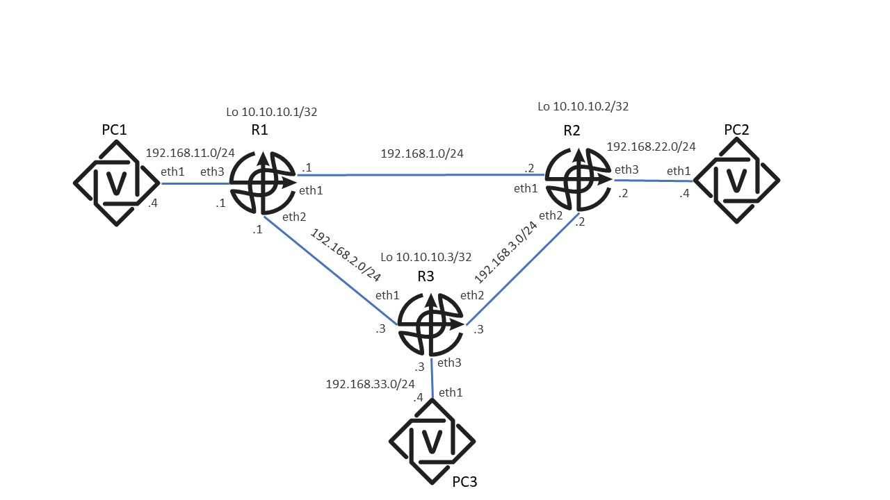

# Лабораторная работа 1: Статическая маршрутизация

# Cхема лабораторной работы:



## Задание к лабораторной работе:

### 1.0 Разобраться с CLI (Command Line Interface) FRR следуя примеру в Приложении для РС1 и R1.
### 1.1 Настроить IP-адресацию на всех устройствах (контейнерах) согласно прилагаемой схеме.
### 1.2 Настроить статические маршруты на каждом маршрутизаторе (FRR), таким образом, чтобы:

1.2.1) Была IP-связность с lo (loopback) интерфейса R1 до lo интерфейсов R2 и R3 (аналогично от lo R2 до lo R1 и R3, от lo R3 до lo R1 и R2)

1.2.2) Была IP-связность между всеми РС

1.2.3) Разорвать (логически) линк между R1 и R2, проверить есть ли связность между РС1 и РС2, объясните полученный результат
### 1.3 Написать генератор конфигурации для остальных PC и R маршрутизаторов на Python
### 1.4 Написать скрипт на Python, делающий парсинг вывода следующих команд в читаемом формате, скрипт должен отображать с какого устройства осуществляется вывод, а для ping/traceroute также куда (на какое устройство) они делаются:

```bash
docker ps

sh run (с каждого устройства)

sh ip route (с каждого устройства)

sh int brief (с каждого устройства)
```

`ping x.x.x.x` (где x.x.x.x - адреса lo интерфейсов других R-маршрутизаторов, если пинг производится с R-маршрутизатора; адреса других РС-маршрутизаторов, если пинг производится с РС-маршрутизатора, пинг должен быть успешным)


`traceroute x.x.x.x` (где x.x.x.x - адреса lo интерфейсов других R-маршрутизаторов, если пинг производится с R-маршрутизатора; адреса других РС-маршрутизаторов, если пинг производится с РС-маршрутизатора, traceroute должен быть успешным и соответствовать сконфигурированным вами статическим маршрутам)
Критерии оценки:
1.Приложить скрипт - генератор конфигурации для всех устройств и сгенерированные им файлы конфигурации (в имени файла должно быть имя соотв. устройства)
2.Приложить скрипт -парсер нужных команд по выводу состояния устройств (show команды+ping/traceroute)
3.По п.1.2.3 своими словами написать несколько предложений, отвечающих на вопрос и объясняющих ситуацию c приложением подкрепляющих выводы show команд.


Дополнительные уточнения по результатам общения в чате:

    достаточно написать генератор для заданной схемы
    студенты пишут генератор конфигурации для топологии лабы
    студенты должны также написать инструкцию к запуску генератора.
    в задание прикладывается сам генератор и сгенерированные им конфигурационные текстовые файлы в формате Имя+Фамилия студента_Имя устройства.conf (например, Иван_Иванов_PC1.conf, Иван_Иванов_R1.conf), а также инструкция по его запуску (куда выкладывать и как - TBD)
    студенты пишут скрипт-парсер конфигурации, в виде программы, которой надо указать на входе опции: между кем проверять связность (IP-адреса узлов или имена), с каких узлов считать show-команды и вывести их на консоль (в модифицированном виде, например:

```
ping 192.168.1.2
PING 192.168.1.2 (192.168.1.2): 56 data bytes
--- 192.168.1.2 ping statistics ---
2 packets transmitted, 2 packets received, 0% packet loss
round-trip min/avg/max = 4.037/4.644/5.251 ms ),
```

Соответственно парсер сам должен подключиться к нужным (заданным) устройствам, запустить требуемые команды и собрать, обработать и выдать нужный вывод. Парсер инструкция для него также прикладывается к заданию вместе с выводом для каждого устройства в формате Имя+Фамилия студента_Имя устройства_output.txt Например: Иван_Иванов_PC1_output.txt

Приложение:

Пример настройки статической маршрутизации:

R1
Часть 1. Настройка IP-адресов и проверка базовой IP-связности между соседними узлами

1.Подключаемся к консоли маршрутизатора:

```bash
~/Documents/frrlab$ sudo docker exec -it clab-frrlab1_1-router1 vtysh

Hello, this is FRRouting (version 8.4_git).
Copyright 1996-2005 Kunihiro Ishiguro, et al.

router1#
```

2. Проверяем имеющиеся интерфейсы

```bash
router1# show interface brief

Interface       Status  VRF             Addresses
---------------------------
eth0            up      default         172.20.20.2/24
                                        + 2001:172:20:20::2/64
eth1            up      default
eth2            up      default
eth3            up      default
lo              up      default
```

3. Конфигурируем заданные IP-адреса на интерфейсах маршрутизатора (FRR)

```bash
router1# conf
router1(config)# int lo0
router1(config-if)# ip address 10.10.10.1/32
router1(config-if)# int eth1
router1(config-if)# ip addr 192.168.1.1/24
router1(config-if)# int eth2
router1(config-if)# ip addr 192.168.2.1/24
router1(config-if)# int eth3
router1(config-if)# ip addr 192.168.11.1/24
router1(config-if)# do wr
```

Аналогично делаем для R2 и R3.

4. Проверка непосредственной связности между маршрутизаторами:

R1
```bash
router1# ping 192.168.1.2
PING 192.168.1.2 (192.168.1.2): 56 data bytes
64 bytes from 192.168.1.2: seq=0 ttl=64 time=0.500 ms
64 bytes from 192.168.1.2: seq=1 ttl=64 time=0.062 ms
64 bytes from 192.168.1.2: seq=2 ttl=64 time=0.055 ms
^C
--- 192.168.1.2 ping statistics ---
3 packets transmitted, 3 packets received, 0% packet loss
round-trip min/avg/max = 0.055/0.205/0.500 ms

router1# ping 192.168.2.3
PING 192.168.2.3 (192.168.2.3): 56 data bytes
64 bytes from 192.168.2.3: seq=0 ttl=64 time=8.042 ms
64 bytes from 192.168.2.3: seq=1 ttl=64 time=0.063 ms
^C
--- 192.168.2.3 ping statistics ---
2 packets transmitted, 2 packets received, 0% packet loss
round-trip min/avg/max = 0.063/4.052/8.042 ms
```

R2

```bash
router2# ping 192.168.3.3
PING 192.168.3.3 (192.168.3.3): 56 data bytes
64 bytes from 192.168.3.3: seq=0 ttl=64 time=1.130 ms
64 bytes from 192.168.3.3: seq=1 ttl=64 time=0.050 ms
64 bytes from 192.168.3.3: seq=2 ttl=64 time=0.048 ms
^C
--- 192.168.3.3 ping statistics ---
3 packets transmitted, 3 packets received, 0% packet loss
round-trip min/avg/max = 0.048/0.409/1.130 ms
```

PC1

    Аналогично - подключаемся к консоли и назначаем IP-адреса

```bash
sudo docker exec -it clab-frrlab1_1-PC1 vtysh
PC1(config)# int eth1
PC1(config-if)# ip addr 192.168.11.4/24
PC1(config-if)# do wr

    Проверяем связность до R1

PC1(config-if)# do ping 192.168.11.1
PING 192.168.11.1 (192.168.11.1): 56 data bytes
64 bytes from 192.168.11.1: seq=0 ttl=64 time=0.145 ms
64 bytes from 192.168.11.1: seq=1 ttl=64 time=0.126 ms
^C

--- 192.168.11.1 ping statistics ---
2 packets transmitted, 2 packets received, 0% packet loss
round-trip min/avg/max = 0.126/0.135/0.145 ms
```

Аналогичную операцию надо провести с РС2 и РС3.

Часть 2. Настройка статической маршрутизации и проверка IP-связности между узлами R1

```
router1# conf
router1(config)# hostname R1
R1(config)# ip route 10.10.10.2/32 192.168.1.2 eth1
R1(config)# ip route 10.10.10.3/32 192.168.2.3 eth2
R1(config)# ip route 192.168.22.0/24 192.168.1.2 eth1
R1(config)# ip route 192.168.33.0/24 192.168.2.3 eth2
R1(config)# do wr
```

PC1 (PC2 и PC3 делаем аналогично, только меняем префиксы для соотв. сетей для РС и lo на R-маршрутизаторах)

```bash
PC1# sh run
Building configuration...
Current configuration:
!
frr version 8.4_git
frr defaults traditional
hostname PC1
!
ip route 10.10.10.0/24 192.168.11.1 eth1
ip route 192.168.22.0/24 192.168.11.1 eth1
ip route 192.168.33.0/24 192.168.11.1 eth1
!

interface eth1
ip address 192.168.11.4/24
exit
!
```

Проверка связности между РС

#PC1 <-> PC2

```bash
PC1# ping 192.168.22.4
PING 192.168.22.4 (192.168.22.4): 56 data bytes
64 bytes from 192.168.22.4: seq=0 ttl=62 time=0.124 ms
64 bytes from 192.168.22.4: seq=1 ttl=62 time=0.108 ms
64 bytes from 192.168.22.4: seq=2 ttl=62 time=0.196 ms
64 bytes from 192.168.22.4: seq=3 ttl=62 time=0.107 ms
^C

--- 192.168.22.4 ping statistics ---
4 packets transmitted, 4 packets received, 0% packet loss

round-trip min/avg/max = 0.107/0.133/0.196 ms
```

#PC1 <-> PC3

```bash
PC1# ping 192.168.33.4
PING 192.168.33.4 (192.168.33.4): 56 data bytes
64 bytes from 192.168.33.4: seq=0 ttl=62 time=0.080 ms
64 bytes from 192.168.33.4: seq=1 ttl=62 time=0.158 ms
64 bytes from 192.168.33.4: seq=2 ttl=62 time=0.084 ms
64 bytes from 192.168.33.4: seq=3 ttl=62 time=0.156 ms
^C

--- 192.168.33.4 ping statistics ---
4 packets transmitted, 4 packets received, 0% packet loss

round-trip min/avg/max = 0.080/0.119/0.158 ms

PC1#
```

Пример (логического) отключения линка:

```bash
router1# conf
router1(config)# int eth1
router1(config-if)# shutdown
```

Проверка, что линк отключен:

```bash
router1(config-if)# do sh int eth1
Interface eth1 is down
Link ups:       1    last: 2024/02/02 13:07:53.63
Link downs:     3    last: 2024/02/03 11:31:10.08
vrf: default
index 39 metric 0 mtu 9500 speed 10000
flags: <BROADCAST,MULTICAST\>
Type: Ethernet
HWaddr: aa:c1:ab:00:fe:60
inet 192.168.1.1/24
Interface Type VETH
Interface Slave Type None
protodown: off
```

Необходимые команды на маршрутизаторах:

```bash
sh run
sh int brief
show ip route
show ip route x.x.x.x
ping x.x.x.x
traceroute x.x.x.x
```