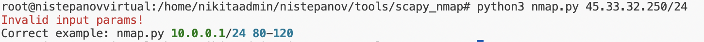
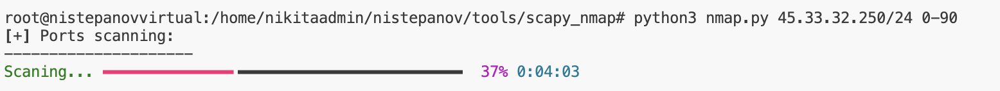
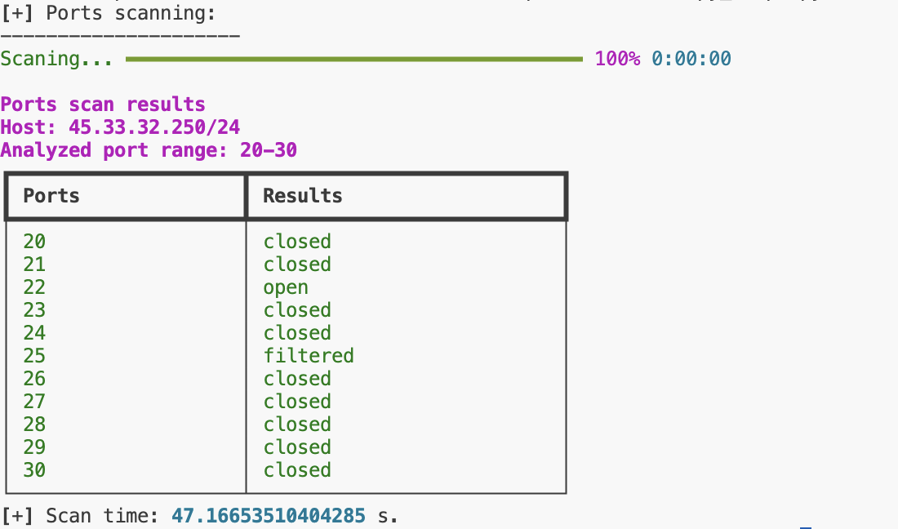

# Отчет о выполнении лабораторной работы scapy_nmap 

Разработана утилита анализа доступности сетевых портов – аналог nmap.  
Пример запуска: `python3 nmap.py 45.33.32.250/24 0-90`  

В случае неправильной конфигурации входных данных, пользователь будет уведомлен об этом:


В процессе работы программа отображает прогресс анализа:


## Тестирование
Отсканируем с помощью созданной утилиты IP адрес хоста `scanme.nmap.org`:  
`python3 nmap.py 45.33.32.250/24 0-90`  

Программа выводит результат в виде информативной таблицы:


Ниже приведен вывод реальной утилиты `nmap` для подсети того же хоста и аналогичного набора портов:  
```
nmap 45.33.32.250/24 -p 20-30

Nmap scan report for 45-33-32-250.ip.linodeusercontent.com (45.33.32.250)
Host is up (0.18s latency).

PORT   STATE    SERVICE
20/tcp closed   ftp-data
21/tcp closed   ftp
22/tcp open     ssh
23/tcp closed   telnet
24/tcp closed   priv-mail
25/tcp filtered smtp
26/tcp closed   rsftp
27/tcp closed   nsw-fe
28/tcp closed   unknown
29/tcp closed   msg-icp
30/tcp closed   unknown

Nmap done: 256 IP addresses (124 hosts up) scanned in 18.71 seconds
```

**Убеждаемся, что вывод аналогичен.**
